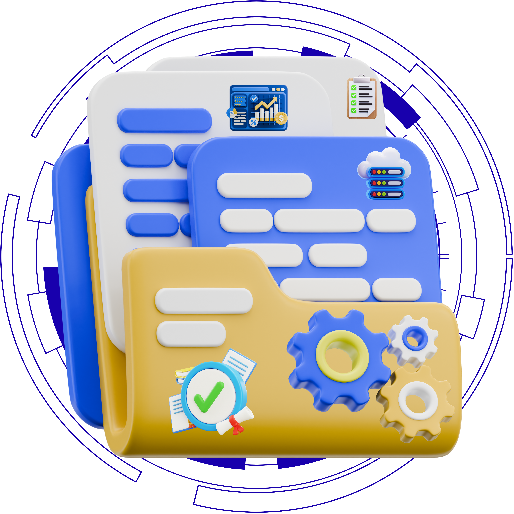

# 🚀 DYnoGix — Enterprise Operations Platform  

  

  <b>AI-Powered Enterprise Workflow Platform</b> 
  <i>Automate • Optimize • Analyze • Scale</i>

  
  
  

---

## ✨ Overview  

**DYnoGix** is a next-generation SaaS-based enterprise operations platform designed to streamline workflows, manage assets, track issues, and deliver AI-powered insights in real time. It provides a unified ecosystem where organizations can automate processes, monitor performance, and make smarter business decisions.

---

## 🚀 Key Highlights  

| Feature | Description |
|--------|------------|
| 🧠 AI Intelligence | Smart assistant for insights & recommendations |
| ⚡ Automation | End-to-end workflow automation |
| 🔐 Security | JWT authentication + RBAC |
| 📊 Analytics | Real-time dashboards & KPIs |
| 🧩 Scalability | Modular and enterprise-ready |
| 🎨 UI/UX | Modern 3D immersive interface |

---

## 🧠 Core Features  

- 🔐 Secure Authentication (JWT-based)  
- 👥 Role-Based Access Control (Admin / Manager / User)  
- 📊 Real-time Analytics Dashboard  
- 🐛 Issue Tracking System  
- 💼 Asset Management  
- 📝 Audit Logs  
- 🤖 AI Assistant  
- ⚡ Workflow Engine  

---

## 🛠 Tech Stack  

| Layer | Technologies |
|------|------------|
| 🖥 Frontend | React (Vite), Tailwind CSS, Three.js, Zustand |
| ⚙ Backend | Node.js, Express.js |
| 🗄 Database | MongoDB Atlas |
| 🔐 Auth | JWT |
| ☁ Deployment | Netlify, Render |

---

## 🏗 Architecture  

User → Frontend → API → Auth → Business Logic → Database → AI Engine  

---

## 📂 Project Structure  

dynogix/  
├── frontend/  
├── backend/  
└── README.md  

---

## ⚙️ Setup  

git clone https://github.com/yourusername/dynogix.git  
cd dynogix  

Frontend  
cd frontend  
npm install  
npm run dev  

Backend  
cd backend  
npm install  
npm run dev  

---

## 🔐 Environment Variables  

Frontend  
VITE_API_URL=http://localhost:5000/api  

Backend  
PORT=5000  
DB_URL=your_mongodb_uri  
JWT_SECRET=your_secret  
NODE_ENV=development  

---

## 📸 Screenshots  

(Add here)  

---

## 🚀 Future Scope  

- Real-time updates (WebSockets)  
- AI predictive analytics  
- Mobile app  
- Integrations (Slack, Jira)  
- Advanced security (2FA, SSO)  

---

## 👨‍💻 Developer  

**Devansh Gupta**  
B.Tech CSE — Lovely Professional University  

GitHub: https://github.com/yourusername  
LinkedIn: https://linkedin.com/in/yourprofile  

---

## ⭐ Support  

If you like this project:  
⭐ Star the repo  
🚀 Share it  

---

  <b>Built with passion, innovation, and real-world problem solving 🚀</b>

